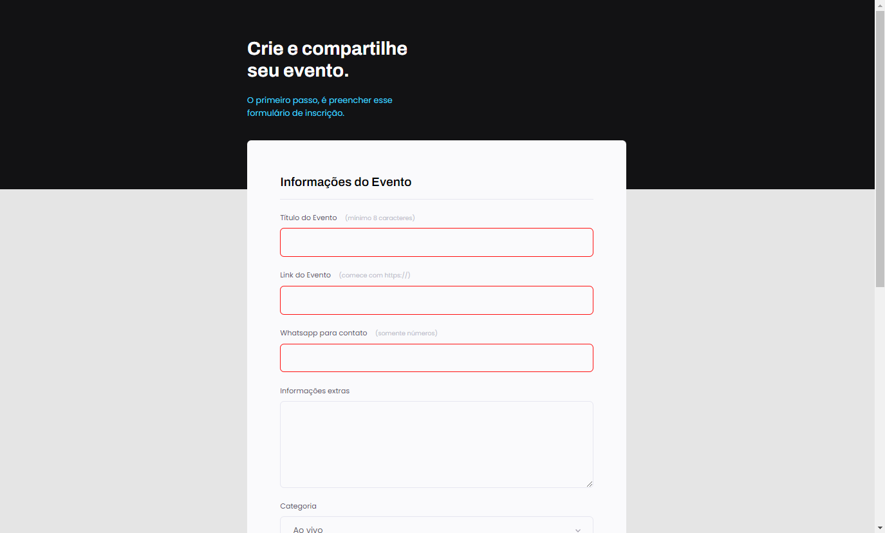

# Explorer Projeto 03 

> Nível 3 do Explorer

Projeto feito com os conhecimentos do curso Explorer da Rocketseat sobre os conceitos de HTML e CSS.

[🔗 Clique aqui para acessar o projeto](https://loren175.github.io/Projeto-03)

## 🚀 Tecnologias

- HTML
- CSS
- Git e Github

## 📞 Contato

>rafael.loren175@gmail.com

## 👾 Discord

>rafas#7622